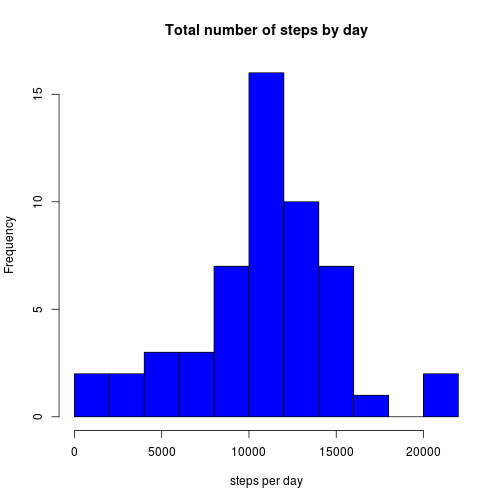
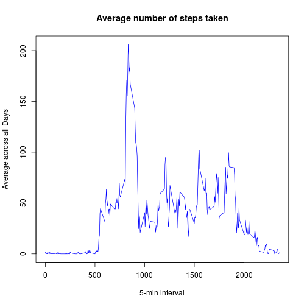
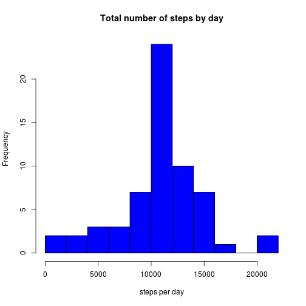
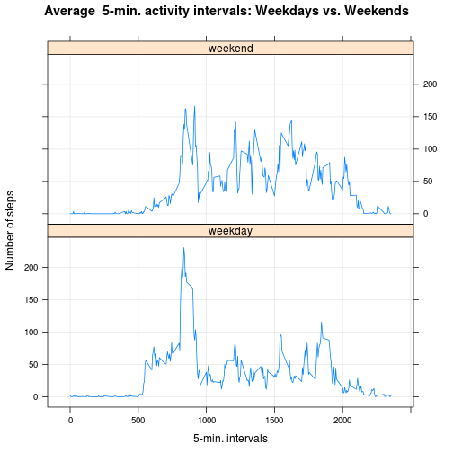

```r
knitr::opts_chunk$set(echo=TRUE)
```


```r
Sys.setlocale(category = "LC_ALL", locale = "en_US.utf8")
last_compute_time<-format(Sys.time(),"%a %b %d %Y %X ")
data_archive_filename<-"activity.zip"
data_filename<-"activity.csv"
```
last computed at : Sun Jun 14 2015 02:12:52 PM  

The data for this assignment was downloaded in june 2015 from the course web site and is included in my github repository 

The variables included in this dataset are:

1. *steps*: Number of steps taking in a 5-minute interval (missing values are coded as NA)

2. *date*: The date on which the measurement was taken in YYYY-MM-DD format

3. *interval*: Identifier for the 5-minute interval in which measurement was taken

## Loading and preprocessing the data
I will first extract data archive  activity.zip in current directory

```r
unzip(data_archive_filename)
```
an load the data inside a dataframe variable called df

```r
df<-read.csv(data_filename)
```
here is a summary of the original data

```r
library(knitr)
kable(summary(df))
```


|   |    steps      |        date     |   interval    |
|:--|:--------------|:----------------|:--------------|
|   |Min.   :  0.00 |2012-10-01:  288 |Min.   :   0.0 |
|   |1st Qu.:  0.00 |2012-10-02:  288 |1st Qu.: 588.8 |
|   |Median :  0.00 |2012-10-03:  288 |Median :1177.5 |
|   |Mean   : 37.38 |2012-10-04:  288 |Mean   :1177.5 |
|   |3rd Qu.: 12.00 |2012-10-05:  288 |3rd Qu.:1766.2 |
|   |Max.   :806.00 |2012-10-06:  288 |Max.   :2355.0 |
|   |NA's   :2304   |(Other)   :15840 |NA             |

*now I will do some preprocessing for the analyse*

first let's use dplyr library to calculate a dataframe with the total number of steps per day

```r
library(dplyr)

df_byday<-df %>%
  dplyr::group_by(date) %>%
  summarise(num_values = n(),
             num_na_values = sum(is.na(steps)),
             total_steps_per_day = sum(steps)
            )
```

now let's create another dafaframe with average steps per interval using the group_by and summarise functions (notice for this I need to convert the Interval as factor first)

```r
df_steps_by_interval<-df %>%
    dplyr::group_by(interval) %>%
  summarise( num_values = n(),
             mean_steps_per_interval = mean(steps, na.rm=TRUE)
            )
```

## What is mean total number of steps taken per day?

here is an histogram of the total number of steps per day

```r
hist(df_byday$total_steps_per_day,main = "Total number of steps by day",breaks=10, xlab = "steps per day", col = "blue")
```

 

here is the mean total number of steps taken per day

```r
mean(df_byday$total_steps_per_day,na.rm = TRUE)
```

```
## [1] 10766.19
```
and here is the median total number of steps taken per day

```r
median(df_byday$total_steps_per_day,na.rm = TRUE)
```

```
## [1] 10765
```


## What is the average daily activity pattern?
Now let's draw a time series plot (i.e. type = "l") of the 5-minute interval (x-axis) and the average number of steps taken, averaged across all days (y-axis)

```r
plot(df_steps_by_interval$interval,df_steps_by_interval$mean_steps_per_interval, type = "l", xlab = "5-min interval", 
    ylab = "Average across all Days", main = "Average number of steps taken", 
    col = "blue")
```

 

Now to answer the question "Which 5-minute interval, on average across all the days in the dataset, contains the maximum number of steps?" I find wich row as the maximum value and filter the dataset to extract only this one

```r
df_steps_by_interval[which.max(df_steps_by_interval$mean_steps_per_interval),]
```

```
## Source: local data frame [1 x 3]
## 
##   interval num_values mean_steps_per_interval
## 1      835         61                206.1698
```


## Imputing missing values

To calculate and report the total number of missing values in the dataset (i.e. the total number of rows with NAs) let's first see the dimension of the original dataset

```r
dim(df)
```

```
## [1] 17568     3
```
the dimension of the complete cases

```r
dim(df[complete.cases(df),])
```

```
## [1] 15264     3
```
and let's make the difference to have the total number of missing values

```r
dim(df)-dim(df[complete.cases(df),])
```

```
## [1] 2304    0
```
we can also have this number of missing row directly  :

```r
number_missing_rows<-nrow(df[!complete.cases(df),])
```
So there is exactly 2304 rows with missing values

Let's have a look on where this missing data is

```r
df_na<-df[!complete.cases(df),]
summary(df_na)
```

```
##      steps              date        interval     
##  Min.   : NA    2012-10-01:288   Min.   :   0.0  
##  1st Qu.: NA    2012-10-08:288   1st Qu.: 588.8  
##  Median : NA    2012-11-01:288   Median :1177.5  
##  Mean   :NaN    2012-11-04:288   Mean   :1177.5  
##  3rd Qu.: NA    2012-11-09:288   3rd Qu.:1766.2  
##  Max.   : NA    2012-11-10:288   Max.   :2355.0  
##  NA's   :2304   (Other)   :576
```

```r
df_na_byday<-df_na %>%
  dplyr::group_by(date) %>%
  summarise( num_values = n()
            )
kable(df_na_byday)
```


|date       | num_values|
|:----------|----------:|
|2012-10-01 |        288|
|2012-10-08 |        288|
|2012-11-01 |        288|
|2012-11-04 |        288|
|2012-11-09 |        288|
|2012-11-10 |        288|
|2012-11-14 |        288|
|2012-11-30 |        288|

So we can see that there are 8 days with no data at all, 
My personal point of vue is that in this case :

*THERE IS NO GOOD REASON TO INVENT DATA THAT DOES NOT EXIST*

so i really would prefer to analyse *REAL* measurements
it's just plain normal "true life"" to accept that a complete day doesn't have any steps measure  at all !

well, that said for this course project, because it's asked to give a strategy to fill in the blanks, i would just use the average number of steps calculated for the same interval over all other available dates

```r
df_NoNA <- df
for(i in 1:nrow(df_NoNA)){
  if (is.na(df_NoNA$steps[i])) {
    df_NoNA$steps[i] <- df_steps_by_interval$mean_steps_per_interval[df_steps_by_interval$interval == df_NoNA$interval[i]];
  }
}
```

and guess what... there a no more missing values, just plenty of complete.cases

```r
nrow(df[!complete.cases(df_NoNA),])
```

```
## [1] 0
```

let's plot the histogram

```r
df_NoNA_byday<-df_NoNA %>%
  dplyr::group_by(date) %>%
  summarise(num_values = n(),
             num_na_values = sum(is.na(steps)),
             total_steps_per_day = sum(steps)
            )
hist(df_NoNA_byday$total_steps_per_day,main = "Total number of steps by day",breaks=10, xlab = "steps per day", col = "blue")
```

 

here is the mean total number of steps taken per day

```r
mean(df_NoNA_byday$total_steps_per_day,na.rm = TRUE)
```

```
## [1] 10766.19
```
and here is the median total number of steps taken per day

```r
median(df_NoNA_byday$total_steps_per_day,na.rm = TRUE)
```

```
## [1] 10766.19
```

*the median value did make a litle shift going to the mean values (that are identical), that's because we were imputing some more mean values into the dataset.*

## Are there differences in activity patterns between weekdays and weekends?

To answer this question let's first separate weekdays from  weekend days.

```r
df_NoNA$dayType <- "weekday"
df_NoNA$dayType[weekdays(as.Date(df_NoNA$date), abb=T) %in% c("Sat","Sun")] <- "weekend"
table(df_NoNA$dayType)
```

```
## 
## weekday weekend 
##   12960    4608
```

make the aggregate data with this new information


```r
df_NoNA_steps_by_interval<-df_NoNA %>%
    dplyr::group_by(dayType,interval) %>%
  summarise( num_values = n(),
             mean_steps_per_interval = mean(steps, na.rm=TRUE)
            )
```

and let's plot this


```r
library(lattice)
xyplot(mean_steps_per_interval ~ interval | dayType, data=df_NoNA_steps_by_interval, type="l", grid=T, layout=c(1,2), ylab="Number of steps", xlab="5-min. intervals", main="Average  5-min. activity intervals: Weekdays vs. Weekends")
```

 

in this dataset there is clearly a trend showing that on the week-end there is more physical activity (more steps)

